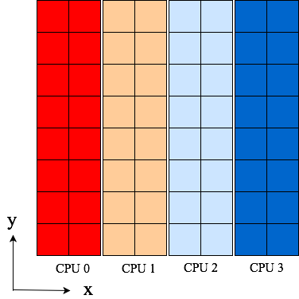

.. _global:

Global Redistributions
======================

In high performance computing large multidimensional arrays are often
distributed and shared amongst a large number of different processors.
Consider a large three-dimensional array of double (64 bit) precision and
global shape :math:`(512, 1024, 2048)`. To lift this array into RAM requires
8 GB of memory, which may be too large for a single, non-distributed
machine. If, however, you have access to a distributed architecture, you can
split the array up and share it between, e.g., four CPUs (most supercomputers
have either 2 or 4 GB of memory per CPU), which will only need to
hold 2 GBs of the global array each. Moreover, many algorithms with varying
degrees of locality can take advantage of the distributed nature of the array
to compute local array pieces concurrently, effectively exploiting multiple
processor resources.

There are several ways of distributing a large multidimensional
array. Two such distributions for our three-dimensional global array
(using 4 processors) are shown below

.. image:: datastructures1.png
    :width: 250px
    :height: 200px

.. image:: datastructures_pencil0.png
    :width: 250px
    :height: 200px

Here each color represents one of the processors. We note that in the first
image only one of the three axes is distributed, whereas in the second two axes
are distributed. The first configuration corresponds to a slab, whereas the
second corresponds to a pencil distribution. With either distribution only one
quarter of the large, global array needs to be kept in rapid (RAM) memory for
each processor, which is great. However, some operations may then require
data that is not available locally in its quarter of the total array. If
that is so, the processors will need to communicate with each other and
send the necessary data where it is needed. There are many such MPI routines
designed for sending and receiving data.

We are generally interested in algorithms, like the FFT, that work on the
global array, along one axis at the time. To be able to execute such algorithms,
we need to make sure that the local arrays have access to all of its
data along this axis. For the figure above, the slab distribution gives each
processor data that is fully available along two axes, whereas the pencil
distribution only has data fully available along one axis. Rearranging data,
such that it becomes aligned in a different direction, is usually termed
a global redistribution, or a global transpose operation. Note that with
mpi4py-fft we always require that at least one axis of a multidimensional
array remains aligned (non-distributed).

Distribution and global redistribution is in mpi4py-fft handled by three
classes in the :mod:`.pencil` module:

    * :class:`.Pencil`
    * :class:`.Subcomm`
    * :class:`.Transfer`

These classes are the low-level backbone of the higher-level :class:`.PFFT` and
:class:`.DistArray` classes. To use these low-level classes
directly is not recommended and usually not necessary. However, for
clarity we start by describing how these low-level classes work together.

Lets first consider a 2D dataarray of global shape (8, 8) that will be
distributed along axis 0. With a high level API we could then simply
do::

    import numpy as np
    from mpi4py_fft import DistArray
    N = (8, 8)
    a = DistArray(N, [0, 1])

where the ``[0, 1]`` list decides that the first axis can be distributed,
whereas the second axis is using one processor only and as such is
aligned (non-distributed). We may now inspect the low-level
:class:`.Pencil` class associated with ``a``::

    p0 = a.pencil

The ``p0`` :class:`.Pencil` object contains information about the
distribution of a 2D dataarray of global shape (8, 8). The
distributed array ``a`` has been created using the information that is in
``p0``, and ``p0`` is used by ``a`` to look up information about
the global array, for example::

    >>> a.alignment
    1
    >>> a.global_shape
    (8, 8)
    >>> a.subcomm
    (<mpi4py.MPI.Cartcomm at 0x10cc14a68>, <mpi4py.MPI.Cartcomm at 0x10e028690>)
    >>> a.commsizes
    [1, 1]

Naturally, the sizes of the communicators will depend on the
number of processors used to run the program. If we used 4, then
``a.commsizes`` would return ``[1, 4]``.

We note that a low-level approach to creating such a distributed array would
be::

    import numpy as np
    from mpi4py_fft.pencil import Pencil, Subcomm
    from mpi4py import MPI
    comm = MPI.COMM_WORLD
    N = (8, 8)
    subcomm = Subcomm(comm, [0, 1])
    p0 = Pencil(subcomm, N, axis=1)
    a0 = np.zeros(p0.subshape)

Note that this last array ``a0`` would be equivalent to ``a``, but
it would be a pure Numpy array (created on each processor) and it would
not contain any of the information about the global array that it is
part of ``(global_shape, pencil, subcomm, etc.)``. It contains the same
amount of data as ``a`` though and ``a0`` is as such a perfectly fine
distributed array. Used together with ``p0`` it contains exactly the
same information as ``a``.

Since at least one axis needs to be aligned (non-distributed), a 2D array
can only be distributed with
one processor group. If we wanted to distribute the second axis instead
of the first, then we would have done::

    a = DistArray(N, [1, 0])

With the low-level approach we would have had to use ``axis=0`` in the
creation of ``p0``, as well as ``[1, 0]`` in the creation of ``subcomm``.
Another way to get the second ``pencil``, that is aligned with axis 0,
is to create it from ``p0``::

    p1 = p0.pencil(0)

Now the ``p1`` object will represent a (8, 8) global array distributed in the
second axis.

Lets create a complete script (``pencils.py``) that fills the array ``a`` with
the value of each processors rank (note that it would also work to follow the
low-level approach and use ``a0``)::

    import numpy as np
    from mpi4py_fft import DistArray
    from mpi4py import MPI
    comm = MPI.COMM_WORLD
    N = (8, 8)
    a = DistArray(N, [0, 1])
    a[:] = comm.Get_rank()
    print(a.shape)

We can run it with::

    mpirun -np 4 python pencils.py

and obtain the printed results from the last line (``print(a.shape)``)::

    (2, 8)
    (2, 8)
    (2, 8)
    (2, 8)

The shape of the local ``a`` arrays is (2, 8) on all 4 processors. Now assume
that we need these data aligned in the x-direction (axis=0) instead. For this
to happen we need to perform a *global redistribution*. The easiest approach
is then to execute the following::

    b = a.redistribute(0)
    print(b.shape)

which would print the following::

    (8, 2)
    (8, 2)
    (8, 2)
    (8, 2)

Under the hood the global redistribution is executed with the help of the
:class:`.Transfer` class, that is designed to
transfer data between any two sets of pencils, like those represented by
``p0`` and ``p1``. With low-level API a transfer object may be created
using the pencils and the datatype of the array that is to be sent::

    transfer = p0.transfer(p1, np.float)

Executing the global redistribution is then simply a matter of::

    a1 = np.zeros(p1.subshape)
    transfer.forward(a, a1)

Now it is important to realise that the global array does not change. The local
``a1`` arrays  will now contain the same data as ``a``, only aligned differently.
However, the exchange is not performed in-place. The new array is as such a
copy of the original that is aligned differently.
Some images, :numref:`2dpencila` and :numref:`2dpencilb`, can be used to
illustrate:

.. _2dpencila:

    Original 4 pencils (p0) of shape (2, 8) aligned in  y-direction. Color
    represents rank.

.. _2dpencilb:

.. figure:: 2Dpencil2.png
    :width: 250px
    :height: 200px

    4 pencils (p1) of shape (8, 2) aligned in x-direction after receiving
    data from p0. Data is the same as in :numref:`2dpencila`, only aligned
    differently.

Mathematically, we will denote the entries of a two-dimensional global array
as :math:`u_{j_0, j_1}`, where :math:`j_0\in \textbf{j}_0=[0, 1, \ldots, N_0-1]`
and :math:`j_1\in \textbf{j}_1=[0, 1, \ldots, N_1-1]`. The shape of the array is
then :math:`(N_0, N_1)`. A global array
:math:`u_{j_0, j_1}` distributed in the first axis (as shown in
:numref:`2dpencila`) by processor group :math:`P`,
containing :math:`|P|` processors, is denoted as

.. math::

    u_{j_0/P, j_1}

The global redistribution, from alignment in axis 1 to alignment in axis 0,
as from :numref:`2dpencila` to :numref:`2dpencilb` above, is denoted as

.. math::

    u_{j_0, j_1/P} \xleftarrow[P]{1\rightarrow 0} u_{j_0/P, j_1}

This operation corresponds exactly to the forward transfer defined above::

    transfer.forward(a0, a1)

If we need to go the other way

.. math::

    u_{j_0/P, j_1} \xleftarrow[P]{0\rightarrow 1} u_{j_0, j_1/P}

this corresponds to::

    transfer.backward(a1, a0)

Note that the directions (forward/backward) here depends on how the transfer
object is created. Under the hood all transfers are executing calls to
`MPI.Alltoallw <https://www.mpich.org/static/docs/v3.2/www3/MPI_Alltoallw.html>`_.

Multidimensional distributed arrays
-----------------------------------

The procedure discussed above remains the same for any type of array, of any
dimensionality. With mpi4py-fft we can distribute any array of arbitrary dimensionality
using any number of processor groups. We only require that the number of processor
groups is at least one less than the number of dimensions, since one axis must
remain aligned. Apart from this the distribution is completely configurable through
the classes in the :mod:`.pencil` module.

We denote a global :math:`d`-dimensional array as :math:`u_{j_0, j_1, \ldots, j_{d-1}}`,
where :math:`j_m\in\textbf{j}_m` for :math:`m=[0, 1, \ldots, d-1]`.
A :math:`d`-dimensional array distributed with only one processor group in the
first axis is denoted as :math:`u_{j_0/P, j_1, \ldots, j_{d-1}}`. If using more
than one processor group, the groups are indexed, like :math:`P_0, P_1` etc.

Lets illustrate using a 4-dimensional array with 3 processor groups. Let the
array be aligned only in axis 3 first (:math:`u_{j_0/P_0, j_1/P_1, j_2/P_2, j_3}`),
and then redistribute for alignment along axes 2, 1 and finally 0. Mathematically,
we will now be executing the three following global redistributions:

.. math::
    :label: 4d_redistribute

    u_{j_0/P_0, j_1/P_1, j_2, j_3/P_2} \xleftarrow[P_2]{3 \rightarrow 2}  u_{j_0/P_0, j_1/P_1, j_2/P_2, j_3} \\
    u_{j_0/P_0, j_1, j_2/P_1, j_3/P_2} \xleftarrow[P_1]{2 \rightarrow 1}  u_{j_0/P_0, j_1/P_1, j_2, j_3/P_2} \\
    u_{j_0, j_1/P_0, j_2/P_1, j_3/P_2} \xleftarrow[P_0]{1 \rightarrow 0}  u_{j_0/P_0, j_1, j_2/P_1, j_3/P_2}

Note that in the first step it is only processor group :math:`P_2` that is
active in the redistribution, and the output (left hand side) is now aligned
in axis 2. This can be seen since there is no processor group there to
share the :math:`j_2` index.
In the second step processor group :math:`P_1` is the active one, and
in the final step :math:`P_0`.

Now, it is not necessary to use three processor groups just because we have a
four-dimensional array. We could just as well have been using 2 or 1. The advantage
of using more groups is that you can then use more processors in total. Assuming
:math:`N = N_0 = N_1 = N_2 = N_3`, you can use a maximum of :math:`N^p` processors,
where :math:`p` is
the number of processor groups. So for an array of shape :math:`(8,8,8,8)`
it is possible to use 8, 64 and 512 number of processors for 1, 2 and 3
processor groups, respectively. On the other hand, if you can get away with it,
or if you do not have access to a great number of processors, then fewer groups
are usually found to be faster for the same number of processors in total.

We can implement the global redistribution using the high-level :class:`.DistArray`
class::

    N = (8, 8, 8, 8)
    a3 = DistArray(N, [0, 0, 0, 1])
    a2 = a3.redistribute(2)
    a1 = a2.redistribute(1)
    a0 = a1.redistribute(0)

Note that the three redistribution steps correspond exactly to the three steps
in :eq:`4d_redistribute`.

Using a low-level API the same can be achieved with a little more elaborate
coding. We start by creating pencils for the 4 different alignments::

    subcomm = Subcomm(comm, [0, 0, 0, 1])
    p3 = Pencil(subcomm, N, axis=3)
    p2 = p3.pencil(2)
    p1 = p2.pencil(1)
    p0 = p1.pencil(0)

Here we have defined 4 different pencil groups, ``p0, p1, p2, p3``, aligned in
axis 0, 1, 2 and 3, respectively. Transfer objects for arrays of type ``np.float``
are then created as::

    transfer32 = p3.transfer(p2, np.float)
    transfer21 = p2.transfer(p1, np.float)
    transfer10 = p1.transfer(p0, np.float)

Note that we can create transfer objects between any two pencils, not just
neighbouring axes. We may now perform three different global redistributions
as::

    a0 = np.zeros(p0.subshape)
    a1 = np.zeros(p1.subshape)
    a2 = np.zeros(p2.subshape)
    a3 = np.zeros(p3.subshape)
    a0[:] = np.random.random(a0.shape)
    transfer32.forward(a3, a2)
    transfer21.forward(a2, a1)
    transfer10.forward(a1, a0)

Storing this code under ``pencils4d.py``, we can use 8 processors that will
give us 3 processor groups with 2 processors in each group::

    mpirun -np 8 python pencils4d.py

Note that with the low-level approach we can now easily go back using the
reverse ``backward`` method of the :class:`.Transfer` objects::

    transfer10.backward(a0, a1)

A different approach is also possible with the high-level API::

    a0.redistribute(out=a1)
    a1.redistribute(out=a2)
    a2.redistribute(out=a3)

which corresponds to the backward transfers. However, with the high-level
API the transfer objects are created (and deleted on exit) during the call
to ``redistribute`` and as such this latter approach may be slightly less
efficient.
